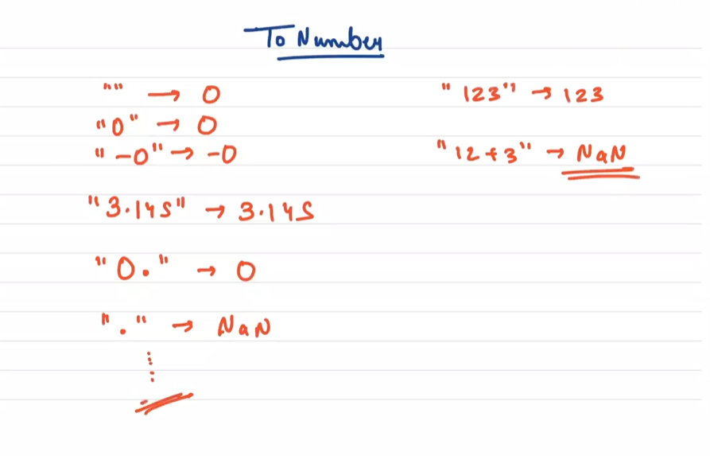
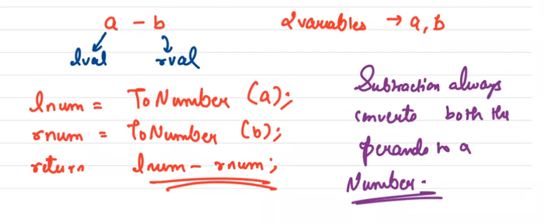
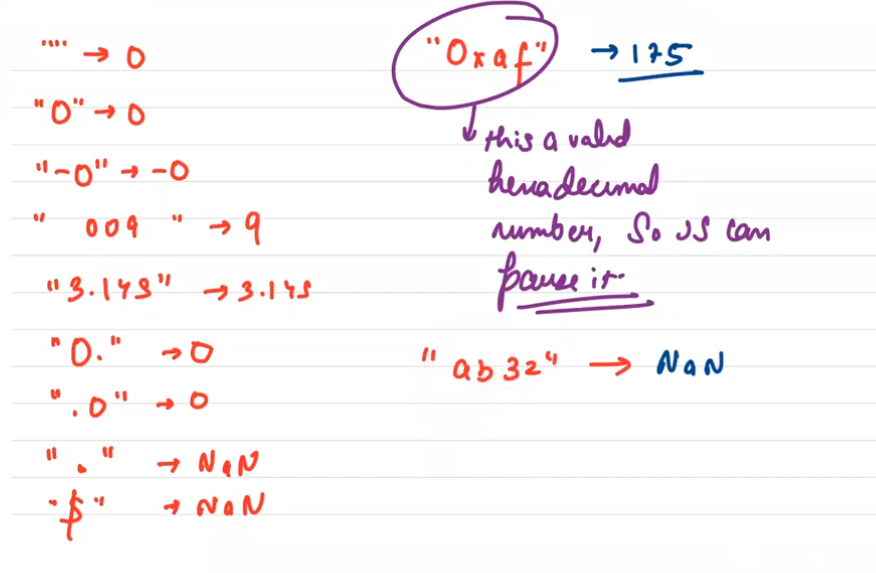
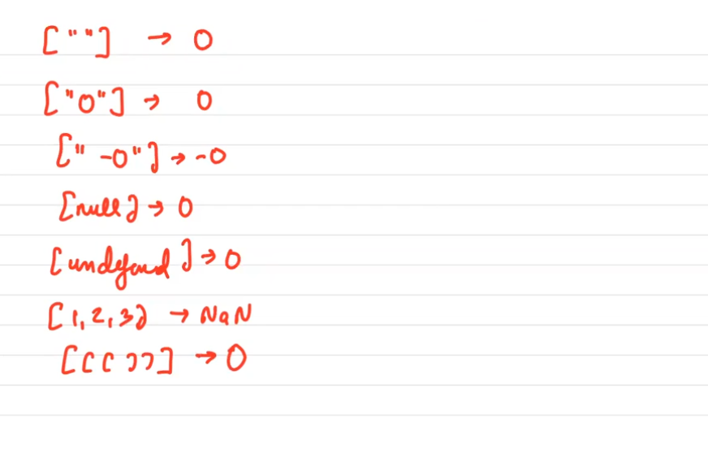
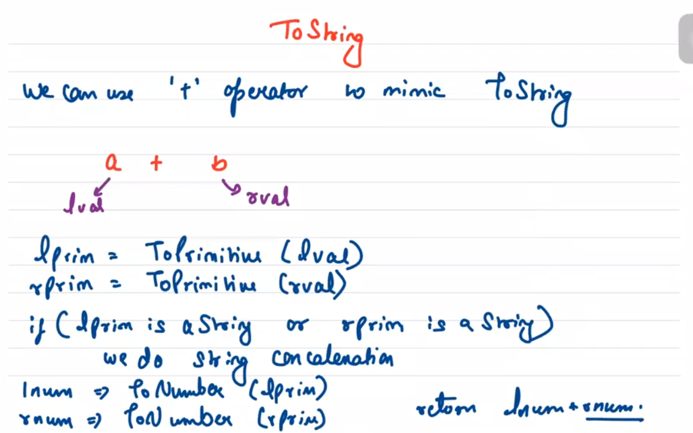
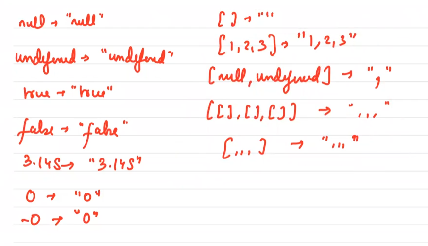
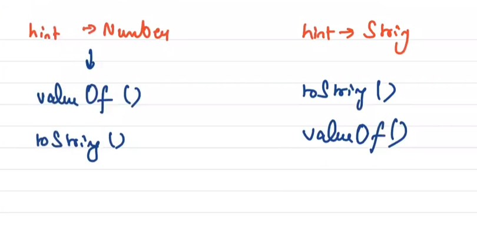
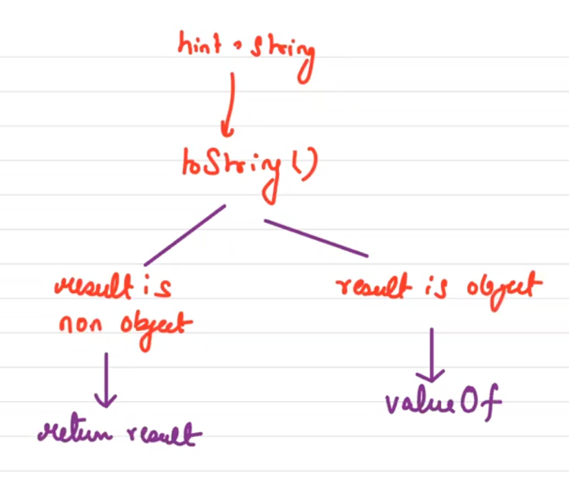
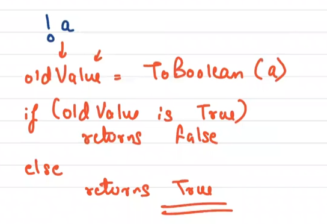

# Coercion

Every language has got some mechanism for type **interconversion**.
for example - in java if we do -> System.out.println("Hello" + 22);

The above code will print -> Hello22 i.e., it did convert 22 from integer to string & then did concatination.

Similarly this concept exist in JS also. For JS things are a bit more tricky as JS handels wide range of cases.

Coercion stands for type inter conversion.

## 1. ToNumber

Whenever in an number operation we don't have a number, ToNumber() is called.
For example **subtraction operation**.

We can use '-' operation to mimic ToNumber.                                     

this are some examples of type conversions.              

more..

## 2. ToString

We can use '+' operator to mimic ToString operation for representation.
 

more of the string operations.

## Abstract Operations

These are experations/functions which are not available for end users to use. But JS internally uses it & these are mentioned in the official docs to actually aid the documentation.

for example: ToString, ToNumber, ToBoolean, ToPrimitive etc.

We cannot directly ccall them. But few JS operations like '-'(subtraction), '+'(addition) etc. Internally calls them & hence we can mimic them using these operations.

C++, Java, C -> types exist for variables.
        
        int x = 10;

JavaScript -> types exist for values.

        let x = 10; // now x = number
        x = "str"; // type conversion is allowed

"Everything in JS is an Object" -> false statement.

first abstract operation that we need to learn is **ToPrimitive**.

## 3. ToPrimitive

* The ToPrimitive abstract operation, takes an input argument and an optional **Preferred Type** argument.
* This operation converts the input to a non-object type values. If an argument is capable of getting converted into more than one primitive type, then the function uses **Preferred Type** argument to resolve it.
* As we said, this is also an abstract operation, that means it is conceptual, we cannot invoke it, but JS internally can.
* The ToPrimitive function prefers string & number conversion.
* if hint/preferred type is number then on our input argument we call valueOf() function to get a number & if it doesn't gets a primitive we call toString() function.
* otherwise, if jint argument is "String" then we call toString() & then valueOf().

 

(internally calls Ordinary to primitive)

This function takes an input argument and tries to convert it into a non object type (primitive type), but if it can't convert it can throw error.

It takes one more optional parameter called as preferred type. If we have 2 or more than 2 values that can became answer, this opition argument helps us.

* if Preferred type is not given, hint(new variable we initialize) = 'default'
* else if preferredtype is "String", hint = "String"
* else preferredtype is "Number", hint = "Number"

    if hint is "default" then hint = "Number"

ValueOf() and toString() are not abstract operations. That means we can call them.

By default toString() on a object returns -> '[object Object]' (this is a random string JS returns)

By default valueOf() -> on an object returns same object.

for array -> valueOf -> same array toString -> print array without parentheses.

## 4. ToBoolean

The ToBoolean abstract operation converts the given type to a Boolean value. ToBoolean works a bit differently when compared to ToString as ToNumber.

It maintains a list of values which when received as an argument returns False. And everything apart from the list of values returns True.

List of Falsy values ->

    null
    undefined
    +0
    -0
    NaN
    "" (empty string)
    false

if we get any one of these values in the argument we return False else we return True.

Q. How can we test the ToBoolean operation?

Ans: We can use **logical Not Operator(!)** 

