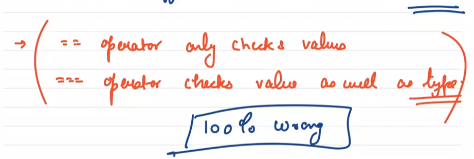
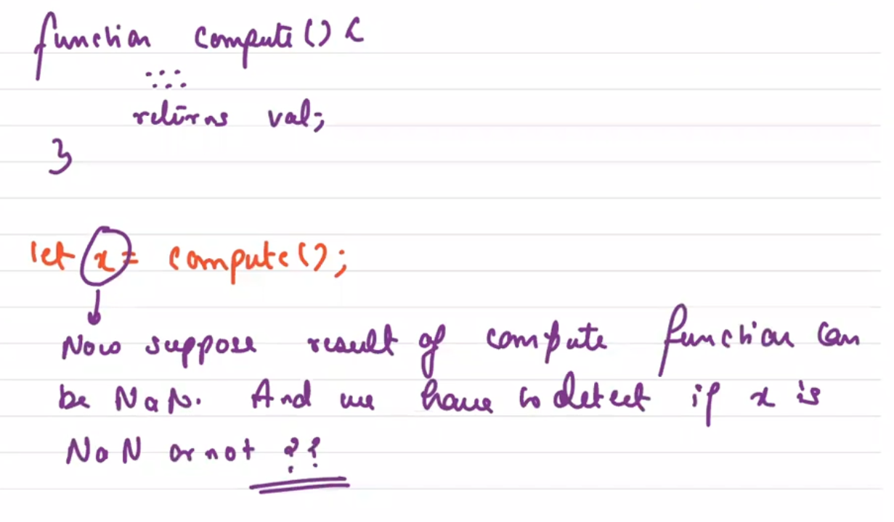

# 1. ToNumber

this are some examples of type conversions.

more..

# 2. ToString

We can use '+' operator to mimic ToString operation for representation.
 

more of the string operations.

# 3. ToPrimitive

(internally calls Ordinary to primitive)

This function takes an input argument and tries to convert it into a non object type (primitive type), but if it can't convert it can throw error.

It takes one more optional parameter called as preferred type. If we have 2 or more than 2 values that can became answer, this opition argument helps us.

* if Preferred type is not given, hint(new variable we initialize) = 'default'
* else if preferredtype is "String", hint = "String"
* else preferredtype is "Number", hint = "Number"

    if hint is "default" then hint = "Number"

ValueOf() and toString() are not abstract operations. That means we can call them.

By default toString() on a object returns -> '[object Object]' (this is a random string JS returns)

By default valueOf() -> on an object returns same object.

for array -> valueOf -> same array toString -> print array without parentheses.

# 4. ToBoolean

The ToBoolean abstract operation converts the given type to a Boolean value. ToBoolean works a bit differently when compared to ToString as ToNumber.

It maintains a list of values which when received as an argument returns False. And everything apart from the list of values returns True.

List of Falsy values ->

    null
    undefined
    +0
    -0
    NaN
    "" (empty string)
    false

if we get any one of these values in the argument we return False else we return True.

Q. How can we test the ToBoolean operation?

Ans: We can use **logical Not Operator(!)** 

# 5. What is the difference between == and === ?

== is the **abstract equality comparison operator** and === is the **strict equality comparison operator**. They both are ways to check for equality.

Actually both == and === checks the types but the difference is both of them do something different after checking the type.

So == does type checking and if types are same it calls === for further operations.

=== checks types & if types are not same return false.

The main difference is

    i. abstract equality (==) does coercion if types are not same.
    ii. strict equality (===) never does coercion.

    Note: In JS NaN is the only Primitive value not equal to itself.

# 6. NaN (Not a Number)

typeOf(NaN) -> number

It doesn't actually mean not a number, rather it gives notion of an invalid number.

# 7. isNaN (function with some issues)

This isNaN function coerces the argument before checking for NaN. Now String is not NaN right?? but when we convert "abc" to a number it becomes NaN and hence isNaN returns true.

# 8. Types Of Programming Language

While developning apps, we might encounter multiple programming languages. Every language might of different properties.

Based how the language executes the code we can categories languages in the following:

    1. Compiled -> C++
    2. Interpreted -> shellScript
    3. Hybrid -> both compiled and interpreted

JavaScript is Hybrid.

# 9. Boxing

It is a phenomenon in JS where it tries to convert primitive into objects.

Boxing can be:

    1. Manual
    2. Automatic

# 10. Scopes

In Simple words, scopes is simply where to look for things. What are we looking for? We are looking for variables & functions.

We have more or less 3 types of scopes in JavaScript:

    1. Global Scope
    2. Function Scope
    3. Block Scope

### 1. Global Scope

If a variable is present in a global scope, then it is accessable everywhere in the JS file.

Q. But how do we define a variable in global scope?

There are many ways -> one of the way is to declare/define variables outside any function.

