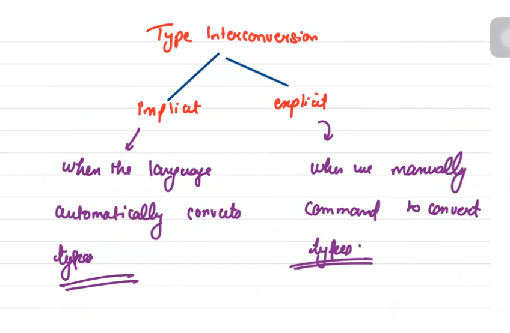
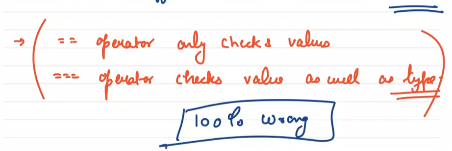
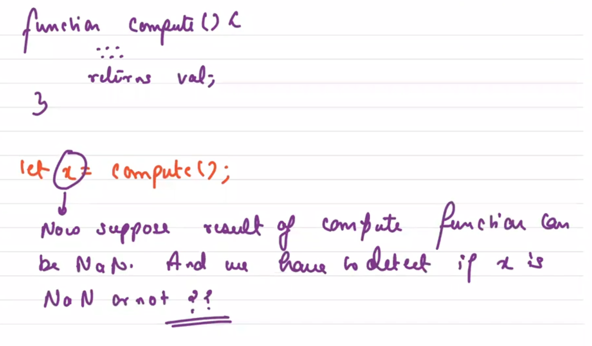

# 1. HTML (Hyper Text Markup Language)

* HTML is the standard markup language for creating Web pages
* HTML describes the structure of a web page.
* HTML consists of a series of elements.
* HTML elements tell the browser how to display the content.

        * <b> - Bold text
        * <strong> - Important text
        * <i> - Italic text
        * <em> - Emphasized text
        * <mark> - Marked text
        * <small> - Smaller text
        * <del> - Deleted text
        * <ins> - Inserted text
        *  - Subscript text
        *  - Superscript text

# 2. CSS (Cascading Style Sheets)

* CSS describes how HTML elements are to be displayed on the screen, paper, or in other media.
* CSS saves a lot of work. It can be control the layout of multiple web pages all at once.

# 3. JS (JavaScript)

* JavaScript, often abbreviated JS, is a programming language that is one of the core technologies of the World Wide Web, alongside HTML and CSS.
* It is a lightweight, interpreted, or just-in-time compiled programming language with first-class functions.
* It is a multi purpose & multi paradigm languages.

# 4. Program And Process

* If we write a code in a file that is a program.
* Program in a running state(execution state) is called process.
        Program --> Process 
* Memory is allocated in RAM for the Program.

# 5. Bitwise Operator

These operators don't directly operate on numbers, but instead operate on binary representation of number.

* Bitwise and -> &
* Bitwise or -> |
* Bitwise Xor -> ^
* Bitwise not -> ~
* left shift -> <<
* right shift -> >>

# 6. Functions

A JavaScript function is a block of code designed to perform a particular task. A JavaScript function is executed when "something" invokes it (calls it).

## <em>Function Invocation</em>

The code inside the function will execute when "something" invokes (calls) the function:

* When an event occurs (when a user clicks a button)
* When it is invoked (called) from JavaScript code
* Automatically (self invoked)

## <em>Return</em>

return keyword returns an output out of the function & immediately stops the functions execution.

        console.log()

returns <b>undefiles</b> after the execution of the line.

# 7. Coercion

Every language has got some mechanism for type **interconversion**.
for example - in java if we do -> System.out.println("Hello" + 22);

The above code will print -> Hello22 i.e., it did convert 22 from integer to string & then did concatination.

Similarly this concept exist in JS also. For JS things are a bit more tricky as JS handels wide range of cases.

Coercion stands for type inter conversion.

# 8. What is the difference between == and === ?

== is the **abstract equality comparison operator** and === is the **strict equality comparison operator**. They both are ways to check for equality.

Actually both == and === checks the types but the difference is both of them do something different after checking the type.

So == does type checking and if types are same it calls === for further operations.

=== checks types & if types are not same return false.

The main difference is

    i. abstract equality (==) does coercion if types are not same.
    ii. strict equality (===) never does coercion.

    Note: In JS NaN is the only Primitive value not equal to itself.

# 9. NaN (Not a Number)

typeOf(NaN) -> number

It doesn't actually mean not a number, rather it gives notion of an invalid number.

# 10. isNaN (function with some issues)

This isNaN function coerces the argument before checking for NaN. Now String is not NaN right?? but when we convert "abc" to a number it becomes NaN and hence isNaN returns true.

# 11. Types Of Programming Language

While developning apps, we might encounter multiple programming languages. Every language might of different properties.

Based how the language executes the code we can categories languages in the following:

    1. Compiled -> C++
    2. Interpreted -> shellScript
    3. Hybrid -> both compiled and interpreted

JavaScript is Hybrid.

# 12. Boxing

It is a phenomenon in JS where it tries to convert primitive into objects.

Boxing can be:

    1. Manual
    2. Automatic

# 13. Scopes

In Simple words, scopes is simply where to look for things. What are we looking for? We are looking for variables & functions.

We have more or less 3 types of scopes in JavaScript:

    1. Global Scope
    2. Function Scope
    3. Block Scope

## 1. Global Scope

If a variable is present in a global scope, then it is accessable everywhere in the JS file.

Q. But how do we define a variable in global scope?

There are many ways -> one of the way is to declare/define variables outside any function.