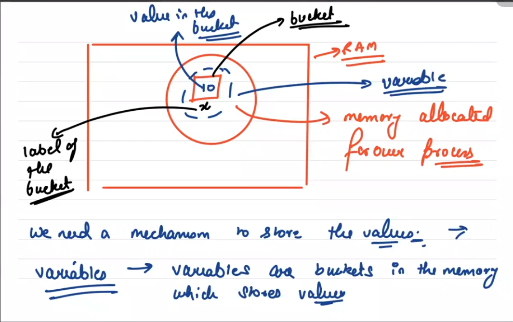
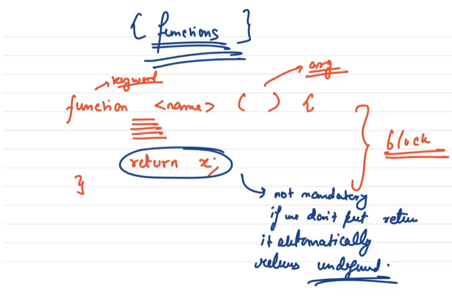

## 1. HTML (Hyper Text Markup Language)

* HTML is the standard markup language for creating Web pages
* HTML describes the structure of a web page.
* HTML consists of a series of elements.
* HTML elements tell the browser how to display the content.

        * <b> - Bold text
        * <strong> - Important text
        * <i> - Italic text
        * <em> - Emphasized text
        * <mark> - Marked text
        * <small> - Smaller text
        * <del> - Deleted text
        * <ins> - Inserted text
        *  - Subscript text
        *  - Superscript text

## 2. CSS (Cascading Style Sheets)

* CSS describes how HTML elements are to be displayed on the screen, paper, or in other media.
* CSS saves a lot of work. It can be control the layout of multiple web pages all at once.

## 3. JS (JavaScript)

* JavaScript, often abbreviated JS, is a programming language that is one of the core technologies of the World Wide Web, alongside HTML and CSS.
* It is a lightweight, interpreted, or just-in-time compiled programming language with first-class functions.
* It is a multi purpose & multi paradigm languages.

## 4. Program And Process

* If we write a code in a file that is a program.
* Program in a running state(execution state) is called process.
        Program --> Process 
* Memory is allocated in RAM for the Program.

## 5. Bitwise Operator

These operators don't directly operate on numbers, but instead operate on binary representation of number.

* Bitwise and -> &
* Bitwise or -> |
* Bitwise Xor -> ^
* Bitwise not -> ~
* left shift -> <<
* right shift -> >>

## 6. Functions

A JavaScript function is a block of code designed to perform a particular task. A JavaScript function is executed when "something" invokes it (calls it).

### <em>Function Invocation</em>

The code inside the function will execute when "something" invokes (calls) the function:

* When an event occurs (when a user clicks a button)
* When it is invoked (called) from JavaScript code
* Automatically (self invoked)

